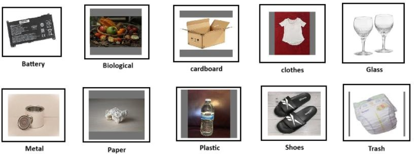

# ♻️ Intelligent Waste Segregation Analytics Using Machine Learning

## 📌 Overview
Intelligent Waste Segregation Analytics is an AI-powered system that uses Machine Learning and Computer Vision to detect, classify, and analyze different types of waste materials. The project helps improve waste management by automating waste segregation and providing useful recycling analytics.

---

## 🚀 Features
- Real-time waste detection and classification
- Image processing using OpenCV
- Machine Learning-based prediction
- Waste analytics and visualization
- Smart segregation recommendations
- User-friendly interface

---

## 🛠️ Technologies Used
- Python
- OpenCV
- Machine Learning
- NumPy
- Pandas
- Matplotlib
- Scikit-learn

---
## 🗂️ Dataset Categories

The dataset used in this project contains multiple categories of waste materials for training and classification.

  

### Categories Included
- Battery
- Biological
- Cardboard
- Clothes
- Glass
- Metal
- Paper
- Plastic
- Shoes
- Trash
## ⚙️ Project Workflow
1. Collect waste image/data samples  
2. Preprocess the dataset  
3. Train the Machine Learning model  
4. Detect and classify waste  
5. Generate analytics and reports  

---

## 🌍 Applications
- Smart Cities
- Recycling Centers
- Waste Management Systems
- Environmental Monitoring

---

## 🔮 Future Improvements
- Deep Learning integration
- IoT-based smart dustbin support
- Mobile application development
- Real-time cloud analytics

---

## 👨‍💻 Author
**Developed by Vijaya Raj**
